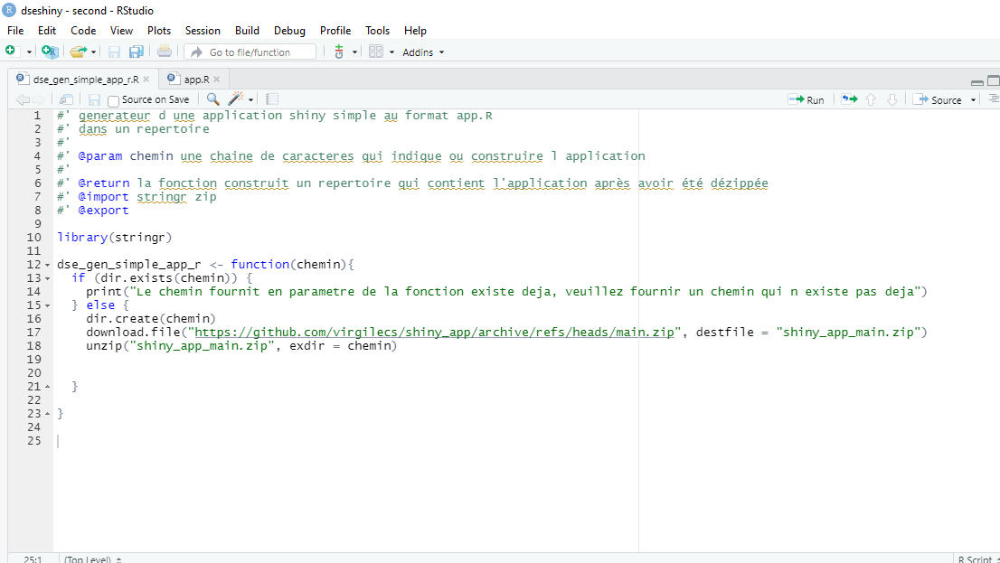
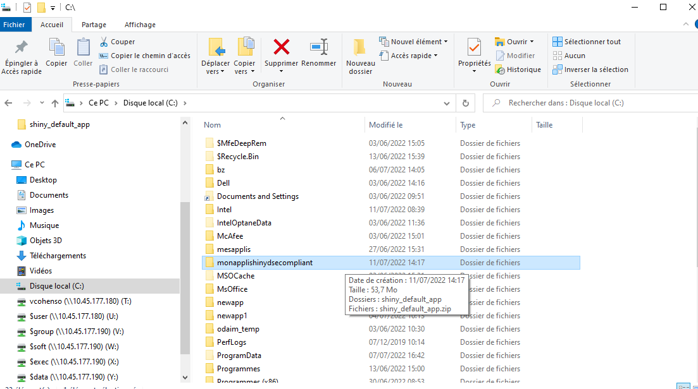

# dseshiny : pour générer une application R shiny conforme au DSE (Design Système de l'Etat)

[lien vers le design système état](https://www.systeme-de-design.gouv.fr/)

## Installer le package


```
# Installation depuis gitlab MTE
library(devtools) 
devtools::install_gitlab( 
  repo="olivier.chantrel/dseshiny", 
  host="https://gitlab-forge.din.developpement-durable.gouv.fr") 
```

## Générer une appli RShiny

Construit localement une appli dans un répertoire qui n'existe pas
Ouvrir le fichier dse_gen_simple_app_r.R (dans le répertoire R) et renseigner la variable "fichier", étant le chemin du fichier zip shiny_default_app.zip 
```
library(dseshiny)
dse_gen_simple_app_r("c:/monapplishinydsecompliant")
```





### Un répertoire "shiny_default_app est généré dans le répertoire de l'appli

L'ouvrir


### Il suffit d'ouvrir le fichier rdsfr.Rproj avec Rstudio


### Puis lancer run app dans le app.R pour voir à quoi ça ressemble


### il n'y a plus qu'à s'occuper du contenu
